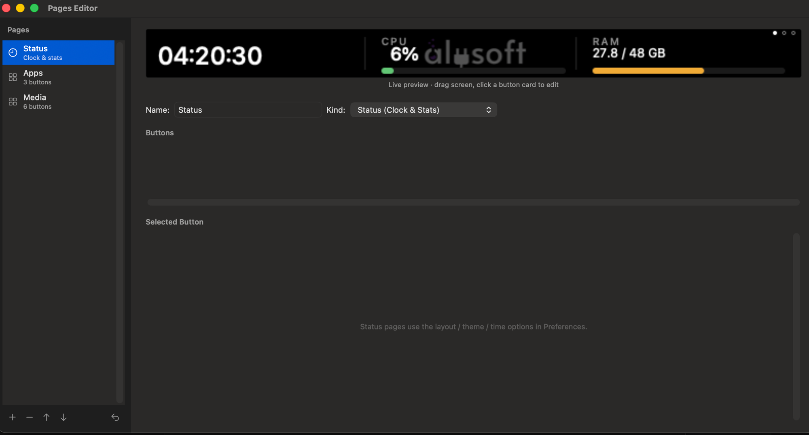
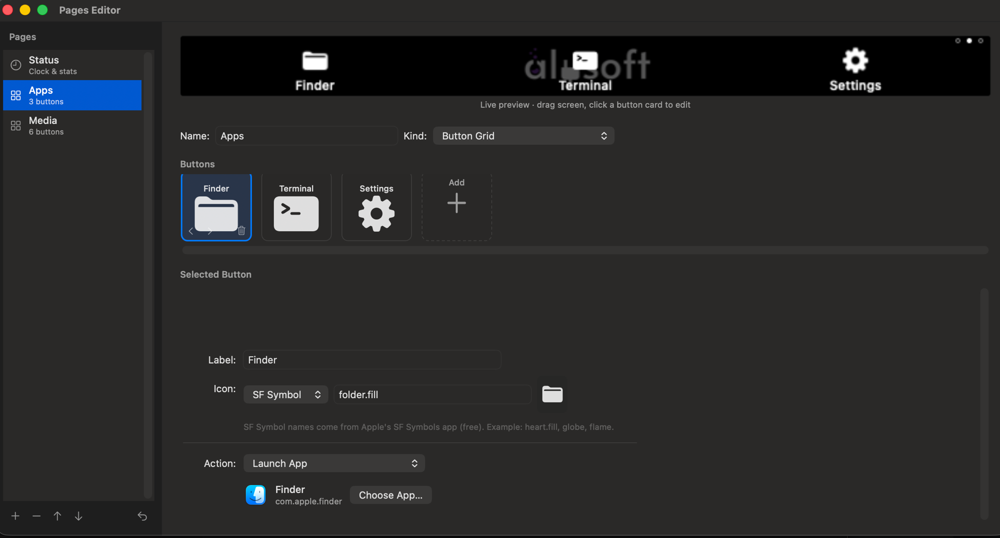
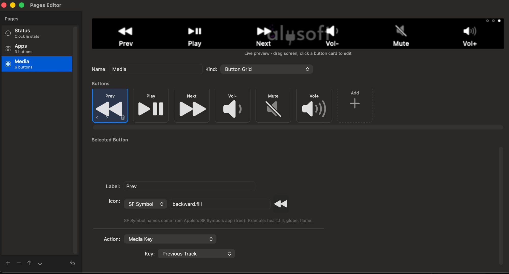
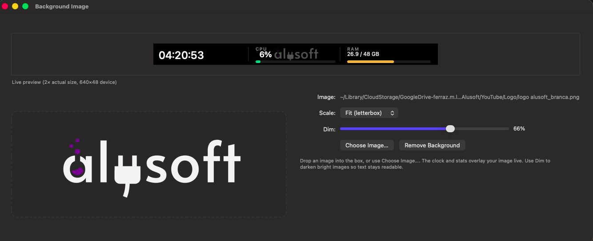
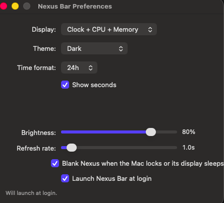

# Nexus Bar

> **A native macOS companion app for the [Corsair iCUE Nexus](https://www.corsair.com/us/en/p/keyboard-accessories/ch-9910010-na/icue-nexus-companion-touch-screen-ch-9910010-na) touchscreen — without iCUE.**
> Apple Silicon native, no Rosetta, no Electron, no kernel extension.
> Just IOKit, AppKit, and ~3K lines of Swift.



The iCUE Nexus is a tiny **640×48 RGB touchscreen** that clips onto a Corsair
keyboard. Corsair only ships it with iCUE — a Windows-first, RGB-bloated suite
that won't run on macOS. This project drives the device directly over USB‑HID
and gives you a fast, native menu-bar app that puts something genuinely useful
on the screen.

---

## What you can do with it

- **Live status dashboard** — clock, CPU, memory, all rendered on the panel and refreshed every second
- **Multiple pages** — swipe between a status page, app launcher, media controls, anything you build
- **Custom button grids** — drop SF Symbols or your own images, wire each button to:
  - Launch an app
  - Open a URL
  - Run a macOS Shortcut
  - Run an arbitrary script
  - Send a keyboard shortcut (⌘C, ⌥⇧4, anything)
  - Send a media key (play/pause, volume, next/previous)
  - Flip pages programmatically
- **Background images** — drop any PNG/JPEG/HEIC into the editor; the live data overlays your image
- **Themes** — Dark, Midnight Blue, Sunset, Monochrome, Ocean
- **Touch UX** — tap a button to fire it; swipe to change pages
- **Locks with your Mac** — display goes completely dark (backlight off) the moment you ⌃⌘Q; wakes back up on unlock
- **Launches at login** — set it once, forget it

---

## Screenshots

| Pages Editor — Status | Pages Editor — Apps |
|---|---|
|  |  |

| Pages Editor — Media | Background Image |
|---|---|
|  |  |

| Preferences |
|---|
|  |

---

## Install

```bash
git clone https://github.com/aluferraz/inexus-osx.git
cd inexus-osx
scripts/build-app.sh /Applications     # build + install to /Applications
open /Applications/NexusBar.app
```

First launch:
- macOS Gatekeeper may complain because the binary is ad‑hoc signed — right‑click → **Open** the first time.
- The menu-bar icon (a small screen-on-screen glyph) appears in the top right.
- The Nexus immediately shows the default **Status** page.

> Requires macOS 13 (Ventura) or later. Tested against iCUE Nexus firmware `2.2.6.0`.

---

## Using the device

The Nexus has just two gestures:

| Gesture | What happens |
|---|---|
| **Swipe left / right** | Cycle through pages (wraps around) |
| **Tap a button** (on a Button Grid page) | Fires that button's action |
| **Tap left half** (on the Status page) | Blank / restore screen |
| **Tap right half** (on the Status page) | Open the menu-bar menu on your Mac |

A small **dot indicator** in the top-right corner shows which page is current.

---

## The Pages Editor (`⌘E`)

Click the menu-bar icon → **Edit Pages…** to manage what shows on the device.

The editor's left sidebar lists every page; the centre column shows a
**2× live preview** of the page (the clock and stats are live, so what you see
is exactly what the device renders right now). Each page is either a
**Status** page (clock + stats, controlled from Preferences) or a **Button Grid**
of up to 12 buttons.

Click any button card to select it; an inspector below lets you edit its
**icon**, **label**, and **action**:

- **Icon** — pick from SF Symbols (Apple's free icon library), drop in any image file, or label-only
- **Label** — optional small text under the icon
- **Action** — a popup with eight types:

| Action | What you configure | macOS permission |
|---|---|---|
| Launch App | App picker (any `.app` from `/Applications`) | none |
| Open URL | Any URL | none |
| Run macOS Shortcut | Shortcut name (from the Shortcuts app) | none |
| Run Script | File picker + space-separated arguments | none |
| Send Keystroke | "Record" button captures the next combo you press | Accessibility, first use |
| Media Key | Play/Pause, Next, Previous, Vol±, Mute | none |
| Next Page / Previous Page | — | none |

The defaults shipped on first launch are sensible starters: **Status**, an
**Apps** grid (Safari, Mail, Finder, Terminal, Notes, Settings), and a **Media**
grid (transport + volume).

---

## Background Image (`⌘I`)

The screen doesn't have to be black. Drop any image into the Background Image
window and your clock and stats overlay it live.


- **Scale mode** — Stretch, Fit (letterbox), Fill (crop), Center (1:1 pixel)
- **Dim slider** — darken the image (0–100%) so light areas don't drown out the text
- **Live preview** — the 2× preview shows the exact frame the device renders, including the live clock

---

## Preferences (`⌘,`)


- **Display** — Clock + CPU, Clock + CPU + Memory, Date + Clock, Clock only, CPU + Memory
- **Theme** — Dark, Midnight Blue, Sunset, Monochrome, Ocean
- **Time format** — 24h or 12h, with or without seconds
- **Brightness** — 0–100
- **Refresh rate** — 0.5s to 10s
- **Blank Nexus when the Mac locks or its display sleeps** — auto-restores on unlock
- **Launch Nexus Bar at login** — managed via `SMAppService`

All settings persist in `UserDefaults` and apply live without restarting.

---

## CLI

`nexusctl` is a small companion CLI for protocol smoke-testing and one-shot
commands. It builds alongside the app:

```text
nexusctl info                     read firmware version
nexusctl brightness 0..100        set backlight (0 turns it off)
nexusctl blank                    clear the panel
nexusctl anim 1|2|3 [--loop]      play firmware-embedded animation
nexusctl stop-anim                stop a looping animation
nexusctl image path/to/img.png    resize and push a single image
nexusctl touch [seconds]          stream touch events to stdout
nexusctl demo                     push a rainbow test pattern
```

---

## How it works

The Nexus is a plain **USB-HID** device (VID `0x1B1C`, PID `0x1B8E`, Usage Page
`0x000C`). No vendor kernel driver, no special handshake.

- **Discovery + I/O** uses `IOHIDManager` directly. No `libusb`, no `hidapi`.
- **Brightness, blank, animations** are sent as Feature reports on report ID `0x03` with single-byte sub-commands.
- **Image upload** is a sequence of 1024-byte output reports on report ID `0x02`: an 8-byte block header (`02 05 40 <last> <blk_lo> <blk_hi> <len_lo> <len_hi>`) followed by up to 1016 bytes of RGBA8 pixel data. A full 640×48 frame is 121 chunks.
- **Touch input** comes back on report ID `0x01` as 64-byte input reports — touch state at byte 5, X coordinate at bytes 6–7 little-endian. A small gesture recogniser collapses the stream into tap / swipe / jitter events.
- **Rendering** uses Core Graphics into a 640×48 RGBA byte buffer, with `NSGraphicsContext` for text. The render loop runs on a dedicated background `DispatchQueue` so slow HID writes can't stall the UI.

Protocol details and constants live in [`Sources/NexusCore/NexusProtocol.swift`](Sources/NexusCore/NexusProtocol.swift).

The original Linux reverse-engineering was done by
[willneedit/NexusTool](https://github.com/willneedit/NexusTool); this project
re-implements the protocol natively on macOS.

---

## Build from source

```bash
swift build -c release                  # core library + nexusctl + NexusBar binary
.build/release/nexusctl info            # quick CLI sanity check

scripts/build-app.sh                    # produces build/NexusBar.app
scripts/build-app.sh /Applications      # build + install
```

The build script ad-hoc codesigns the bundle so launch services will trust it
on the same machine. To distribute to others you'll need a Developer ID and
notarization — that's outside the scope of this repo.

---

## Permissions

| Feature | Permission needed |
|---|---|
| Everything except `Send Keystroke` | None |
| `Send Keystroke` action | Accessibility (System Settings → Privacy & Security → Accessibility) — prompted on first use |
| `Launch at login` | System Settings → General → Login Items will list **Nexus Bar** — managed via `SMAppService` |

No entitlements, no kext, no userspace USB driver. The Nexus is a generic HID
class device and macOS doesn't gate HID reports to non-keyboard / non-pointer
devices.

---

## License

MIT. Not affiliated with, endorsed by, or trademark-associated with Corsair.
"iCUE" and "Nexus" are Corsair's marks; this project's name borrows the
device name solely to identify what it controls.
